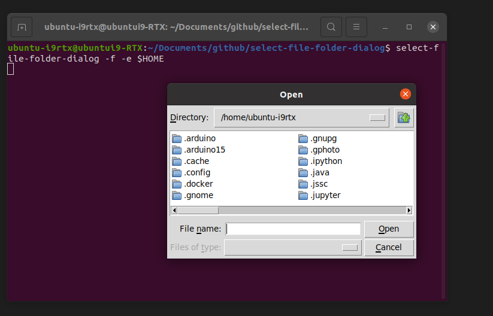

# select-file-folder-dialog
folder dialog for bash



## Install

```bash
git clone https://github.com/Ar-Ray-code/select-file-folder-dialog.git
cd select-file-folder-dialog
sudo bash install.bash install
```

## Uninstall

```bash
cd select-file-folder-dialog
sudo bash install.bash uninstall
```

## Usage

```bash
# simple (Folder select)
$ select-file-folder-dialog

# File select
$ select-file-folder-dialog -f

# Using entry point
$ select-file-folder-dialog -f -e $HOME
```

## Return

- Not selected (or press esc key)
  - None
- Selected folder or file
  - Absolute path of selected folder or file.
